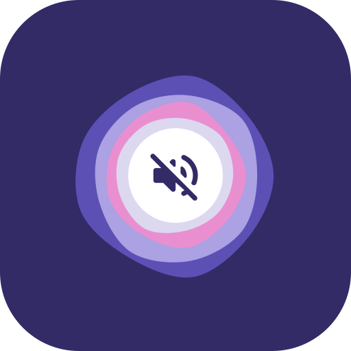
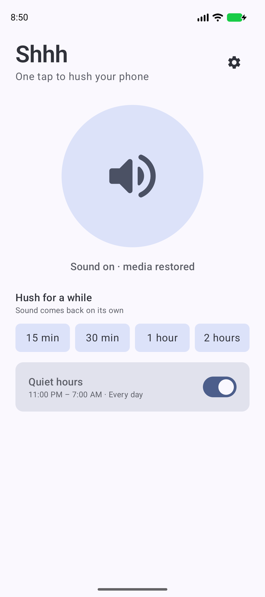
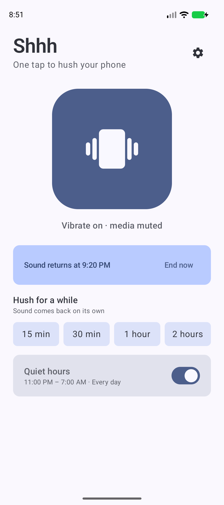
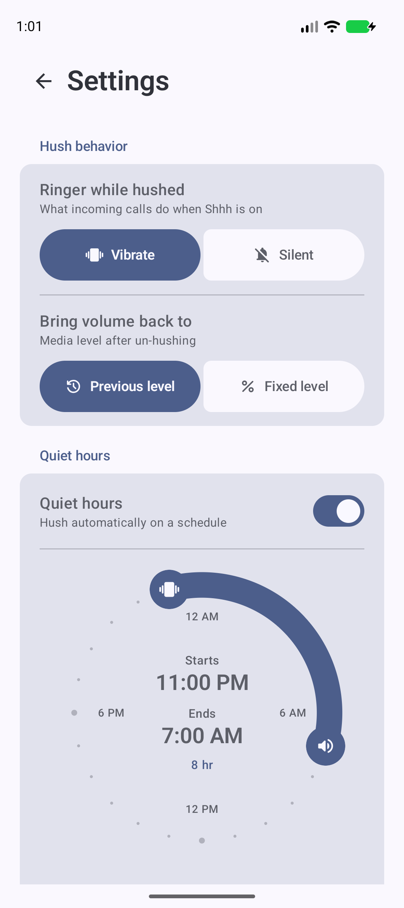
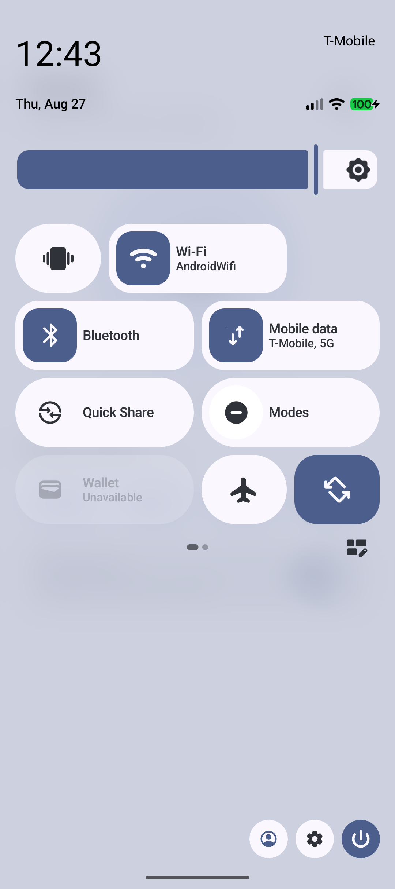
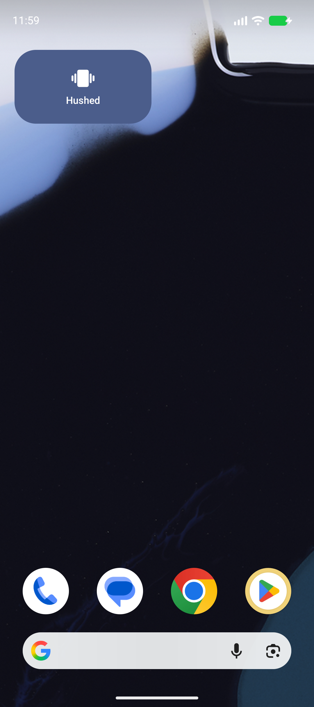

<p align="center">
  
</p>

<h1 align="center">Shhh &#129323;</h1>

<p align="center">
  <strong>One tap to hush your phone</strong> — ringer to vibrate, media volume to zero.<br>
  Tap again and everything comes back.
</p>

<p align="center">
  <a href="https://github.com/7sStudio/shhh-app/actions/workflows/ci.yml"></a>
  <a href="https://github.com/7sStudio/shhh-app/releases/latest"></a>
  <a href="LICENSE"></a>
  <a href="https://developer.android.com/tools/releases/platforms#14"></a>
  <a href="https://kotlinlang.org"></a>
  <a href="https://developer.android.com/develop/ui/compose"></a>
  
</p>

<p align="center">
  <a href="https://github.com/7sStudio/shhh-app/releases/latest"></a>
  <a href="https://apps.obtainium.imranr.dev/redirect.html?r=obtainium://add/https://github.com/7sStudio/shhh-app"></a>
</p>

A tiny, modern quiet-mode toggle for the moments you need silence *now*: meetings, movies, sleep. No accounts, no ads, no analytics — the network is touched only if you use the built-in updater, and then only to ask GitHub for the latest release.

| Home | Timed hush | Settings | Quick Settings tile | Widget |
| :---: | :---: | :---: | :---: | :---: |
|  |  |  |  |  |

## Features

- **One-tap hush** from three surfaces: a **Quick Settings tile**, a **home screen widget**, or the app — ring volume to 0, media volume to 0.
- **Smart restore** — un-hushing brings media volume back to exactly what it was before (or a fixed level you choose).
- **Timed hush** — 15 min, 30 min, 1 h or 2 h; sound returns on its own at the exact minute, with an optional **Live Update countdown** in the status bar and a "Restore now" action.
- **Quiet hours** — automatic schedule with start/end times and per-weekday control.
- **Headphones option** — media un-mutes when Bluetooth headphones connect; the ringer stays hushed.
- **Launcher shortcuts** — long-press the app icon: Toggle · Hush 30 min · Hush 1 hour.
- **Automation friendly** — Tasker, MacroDroid and routines can trigger it (see below).
- **True to reality** — the toggle reads the phone's *actual* state, so it never drifts out of sync with the volume keys or system settings.
- **Alarms always ring** — Shhh only ever moves the ring and media sliders. The alarm stream is a separate one it never touches, so a hushed phone still wakes you at full alarm volume. (Android's own "Total silence" mode does silence alarms — that is your setting doing it, not Shhh.)
- **Never touches Do Not Disturb** — Shhh moves two volume sliders and nothing else. It never switches ringer modes, so it can neither start nor end a Do Not Disturb, Bedtime or driving mode. If one of yours is running, it wins: un-hushing restores the sliders and your mode keeps the phone as quiet as you told it to.
- **Material 3 Expressive** — dynamic Material You colors from your wallpaper and palette, light/dark, themed icon, springy shape-morphing UI.
- **Multilingual** — fully translated into **French**, **Arabic**, **Spanish**, **Portuguese**, **Simplified Chinese**, **Japanese**, **Korean**, **Hindi**, **Bengali**, **Russian**, **Urdu** and **German**, with full Right-to-Left (RTL) support for Arabic and Urdu.
- **Built-in updater** — an optional hourly check against this repo's [latest release](https://github.com/7sStudio/shhh-app/releases/latest) (off by default), plus a manual "Check for updates" in Settings that downloads the APK and hands it to Android's installer.

## What access it needs, and why

All grants are official Android switches — no root, no Shizuku, no ADB.

| Access | Why | Required? |
| --- | --- | --- |
| **Do Not Disturb access** | Android refuses volume changes across the silent boundary *while a Do Not Disturb, Bedtime or driving mode is running*. Shhh never turns those modes on or off — it just needs this to keep working during one | Optional; only needed to hush or un-hush while such a mode is active |
| **Alarms & reminders** | So timers and quiet hours fire at the exact minute, even in Doze | Only for timed hush / quiet hours |
| **Notifications** | The optional countdown and the headphones tap-to-restore offer | Optional |
| **Nearby devices** | Only to hear "Bluetooth headphones connected" | Only for the headphones option |
| **Internet** | Only for the updater: one request to the GitHub releases API and the APK download. Nothing is ever uploaded | Only for update checks |
| **Install unknown apps** | Lets the downloaded update be handed to Android's installer | Only to install an update |

The app asks for each one in context, the first time the matching feature is used.

## Automation

Any app that can start an activity can drive Shhh — the actions only ever affect sound state:

```
am start -n io.github.shhhapp.shhh/.ToggleActivity \
  -a io.github.shhhapp.shhh.action.HUSH --ei duration_minutes 45
```

| Action | Effect |
| --- | --- |
| `…shhh.action.HUSH` | Hush now; optional `duration_minutes` extra |
| `…shhh.action.UNHUSH` | Restore sound |
| `…shhh.action.TOGGLE` | Flip current state |
| `…shhh.action.RESTORE_MEDIA` | Media volume only; ringer stays hushed |

## How it's built

- **100% AI-developed** — every line of code, test and document in this repository was written by AI.
- **100% Kotlin**, single module, AndroidX only — zero third-party runtime dependencies.
- **Jetpack Compose** with **Material 3 Expressive**; widget via **Jetpack Glance**; tile via `TileService`.
- Core logic isolated and fully unit-tested: [`QuietModeController`](app/src/main/kotlin/io/github/shhhapp/shhh/core/QuietModeController.kt) (audio state), [`HushManager`](app/src/main/kotlin/io/github/shhhapp/shhh/core/HushManager.kt) (timers/orchestration), [`QuietHours`](app/src/main/kotlin/io/github/shhhapp/shhh/core/QuietHours.kt) (schedule math).

### The Android 16+ audio-hardening design

Since Android 16/17, the OS **silently ignores** volume changes from backgrounded processes (`AS.HardeningEnforcer`) — and tile taps, widget taps and alarm receivers are all background. Shhh uses the two officially sanctioned paths:

- **A visible activity is always allowed.** Widget taps, launcher shortcuts, notification actions and automation intents route through [`ToggleActivity`](app/src/main/kotlin/io/github/shhhapp/shhh/ToggleActivity.kt) — invisible, zero-animation, toggles and finishes in the same frame.
- **A foreground service is always allowed.** Scheduled transitions (timer expiry, quiet-hours start) fire an exact alarm whose receipt permits starting [`HushService`](app/src/main/kotlin/io/github/shhhapp/shhh/schedule/HushService.kt) — it lives for under a second, applies the change, and stops.

The **Quick Settings tile** takes the service path rather than the activity one, and that is deliberate. A tile can only launch an activity through `startActivityAndCollapse`, which closes the notification shade by definition — so routing tile taps through `ToggleActivity` made the panel slam shut on every tap. Handing the work to `HushService` applies the change with no UI at all, so the tile behaves like Wi-Fi or the torch and the shade stays exactly where you left it. (Opening the app to grant Do Not Disturb access still collapses the shade, which is what a tile is meant to do when it opens an app.)

> ⚠️ Contributors: do **not** bump `targetSdk` to 37 without a redesign — Android 17's while-in-use requirement breaks the alarm → FGS → volume path (`app/build.gradle.kts` has the note).

## Troubleshooting

On some devices (especially Xiaomi, Samsung, and OnePlus), the system might kill the app's background tasks to save battery, causing timed hush or quiet hours to miss their mark. If this happens, visit **[dontkillmyapp.com](https://dontkillmyapp.com)** for instructions on how to whitelist Shhh.

## Building

Requires JDK 17+ and the Android SDK (or just open the project in Android Studio).

```bash
./gradlew assembleDebug          # build
adb install -r app/build/outputs/apk/debug/app-debug.apk
```

For a signed release build, create `keystore.properties` in the project root (never committed):

```properties
storeFile=path/to/release.keystore
storePassword=…
keyAlias=…
keyPassword=…
```

## Testing

```bash
./gradlew testDebugUnitTest      # 277 JVM unit tests (Robolectric + Compose UI test)
./gradlew koverVerifyDebug       # coverage gate
./gradlew koverHtmlReportDebug   # coverage report -> app/build/reports/kover/htmlDebug
./gradlew connectedAndroidTest   # integration tests on a device/emulator
./gradlew lintDebug              # Android Lint
```

Every line of the app is covered except one: the `throw NoWhenBranchMatchedException()`
Kotlin emits for the exhaustive `when` over the two-value `Screen` enum, which is
unreachable without adding a third screen. `koverVerifyDebug` enforces that, so a
regression fails the build. The Compose screens, the Glance widget, the Quick
Settings tile, the trampoline activity, the alarm receivers and the momentary
foreground service all run headless under Robolectric.

CI builds, tests, checks coverage and lints every push; tagging `v*` builds and publishes a release APK automatically.

## Distribution

- **GitHub Releases** — APKs are attached by the [release workflow](.github/workflows/release.yml), and the app's built-in updater keeps installs current from there.
- **Play-ready** — targetSdk meets current Play requirements; the `specialUse` foreground service declaration text is in the manifest; [privacy policy](PRIVACY.md) included.

## Icon licensing

App, tile and widget glyphs are from [Material Symbols](https://fonts.google.com/icons) by Google, used under the [Apache License 2.0](https://github.com/google/material-design-icons/blob/master/LICENSE).

## License

[Apache License 2.0](LICENSE)
